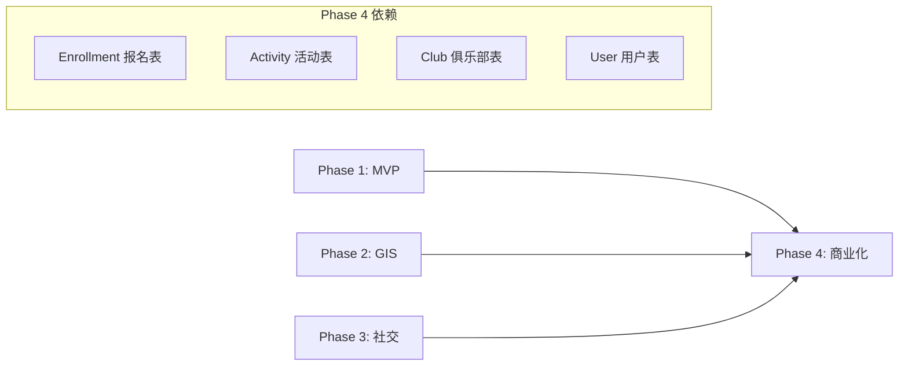

# 户外运动管理平台 Phase 4 (商业化与后台管理) 开发计划 V2.0

**版本**: 2.0 (优化版)
**周期**: Week 10-12 (3周)
**目标**: 实现平台商业化闭环，包括订单支付、保险集成、俱乐部管理、财务结算与核销体系。
**核心原则**: 安全优先、数据真实、闭环完整。

---

## 1. 与前置阶段的关系

### 1.1 依赖关系



### 1.2 与 Enrollment 的关系 (Critical)

Phase 1 已有 `Enrollment` 表管理报名状态，Phase 4 的 `Order` 表是其支付载体：

```
用户报名流程:
1. 点击"报名" → 创建 Enrollment (status=PENDING)
2. 确认支付 → 创建 Order (enrollmentId 关联)
3. 支付成功 → Order.status=PAID, Enrollment.status=PAID
4. 活动核销 → Enrollment.status=CHECKED_IN, Order.status=COMPLETED
5. 活动结束 → Activity.status=COMPLETED, 触发结算
```

---

## 2. 核心功能模块

### 2.1 订单与支付系统 (Orders & Payments)

**核心流程**:
```
创建订单 → 预支付 → 支付中 → 支付回调 → 已支付 → 核销/完成
              ↓                              ↓
         15分钟超时 → 自动取消          申请退款 → 审批 → 退款
```

**功能清单**:
| 功能 | 描述 | 优先级 |
|:---|:---|:---|
| 创建订单 | 关联 Enrollment，生成业务订单号 | P0 |
| 微信支付 | JSAPI 统一下单、回调处理 | P0 |
| 超时取消 | 15分钟未支付自动取消 | P0 |
| 退款申请 | 用户发起，根据退款策略自动计算退款金额 | P0 |
| 订单查询 | 用户查看自己的订单列表/详情 | P0 |
| 幂等处理 | 防止重复支付/重复退款 | P0 |

### 2.1.1 退款策略配置 (Refund Policy) 🆕

**设计目的**: 自动计算退款金额，减少人工扯皮，提升用户体验

**策略规则** (可在活动/俱乐部级别配置):
```
示例: 某登山活动退款规则
┌─────────────────────────────────────────────────┐
│  活动开始前 7 天以上  →  全额退款 (100%)        │
│  活动开始前 3-7 天    →  退款 80%               │
│  活动开始前 1-3 天    →  退款 50%               │
│  活动开始前 24 小时内 →  不可退款 (0%)          │
│  活动取消            →  全额退款 + 补偿         │
└─────────────────────────────────────────────────┘
```

**功能清单**:
| 功能 | 描述 | 优先级 |
|:---|:---|:---|
| 俱乐部默认策略 | 俱乐部设置默认退款规则 | P0 |
| 活动级覆盖 | 特殊活动可单独设置退款规则 | P1 |
| 自动计算 | 用户申请退款时自动计算可退金额 | P0 |
| 退款预览 | 申请前展示预计退款金额 | P0 |
| 活动取消补偿 | 活动方取消时可配置额外补偿 | P2 |

### 2.2 保险模块 (Insurance) 🆕

**战略依据**: "强制要求所有活动购买保险（未购保险的活动无法发布）"

**MVP 实现策略**: 采用 **"记账式"保险**
> 由于保险 API 对接商务流程较长，MVP 阶段先做记账式实现：
> 1. 用户支付时包含保险费用，系统生成保险记录
> 2. 运营人员每日导出待投保名单
> 3. 统一在保险公司后台投保
> 4. 回填保单号到系统
> 5. 后续迭代再对接保险 API 实现自动化

**功能清单**:
| 功能 | 描述 | 优先级 | MVP实现 |
|:---|:---|:---|:---|
| 保险产品配置 | 平台配置保险产品与价格 | P0 | ✅ |
| 记账式购买 | 订单创建时生成保险记录 | P0 | ✅ 记账 |
| 待投保导出 | 导出未投保名单供运营处理 | P0 | ✅ |
| 保单回填 | 运营回填保单号 | P0 | ✅ |
| 保单查询 | 用户查看保单信息 | P1 | ✅ |
| 理赔入口 | 提供第三方理赔链接 | P2 | ✅ |
| API 自动投保 | 对接保险公司 API | P3 | ⏳ 后续迭代 |

### 2.3 俱乐部管理后台 (Club Management)

**功能清单**:
| 功能 | 描述 | 优先级 |
|:---|:---|:---|
| 管理中心 | 俱乐部数据概览 Dashboard | P0 |
| 活动管理 | 活动列表、状态管理、报名统计 | P0 |
| 成员管理 | 成员列表、角色管理 | P1 |
| 核销工具 | 扫码核销订单 | P0 |
| 设置中心 | 俱乐部信息、提现账户设置 | P1 |

### 2.4 财务结算体系 (Financial Settlement)

**资金流转规则**:
```
用户支付 100元
    ↓
平台监管账户 (冻结)
    ↓
活动结束 + 24小时确认期
    ↓
自动结算:
  - 平台服务费 5% = 5元
  - 俱乐部余额 = 95元
    ↓
俱乐部申请提现 → 平台审核 → 打款
```

**功能清单**:
| 功能 | 描述 | 优先级 |
|:---|:---|:---|
| 余额管理 | 俱乐部账户余额查询 | P0 |
| 流水记录 | 收入/支出/退款/提现明细 | P0 |
| 自动结算 | 活动结束后自动分账 | P0 |
| 提现申请 | 提现到银行卡/微信零钱 | P1 |
| 对账报表 | 按活动/按月统计 | P2 |

---

## 3. 数据库设计 (Prisma Schema)

### 3.1 更新现有模型

```prisma
// 更新 Enrollment 模型 - 添加订单关联
model Enrollment {
  // ... 现有字段 ...

  // 新增
  order     Order?    // 一对一关联订单
}
```

### 3.2 新增模型

```prisma
// ==================== 退款策略 ====================
model RefundPolicy {
  id              String   @id @default(uuid())
  name            String   // 策略名称，如 "标准退款策略"
  description     String?  // 策略说明

  // 退款规则 (JSON 数组)
  // [{"hoursBeforeStart": 168, "refundPercent": 100}, {"hoursBeforeStart": 72, "refundPercent": 80}, ...]
  rules           String   // JSON 格式存储

  // 不可退款时间点 (活动开始前 X 小时)
  noRefundHours   Int      @default(24)

  // 活动取消时的退款比例
  cancelRefundPercent Int  @default(100)

  // 关联
  clubId          String?  // 如果为空，则是平台默认策略
  isDefault       Boolean  @default(false) // 是否为默认策略

  createdAt       DateTime @default(now())
  updatedAt       DateTime @updatedAt

  club            Club?    @relation(fields: [clubId], references: [id])
  activities      Activity[]

  @@index([clubId])
}

// 退款规则 JSON 结构示例:
// [
//   { "hoursBeforeStart": 168, "refundPercent": 100 },  // 7天以上全退
//   { "hoursBeforeStart": 72,  "refundPercent": 80 },   // 3-7天退80%
//   { "hoursBeforeStart": 24,  "refundPercent": 50 },   // 1-3天退50%
//   { "hoursBeforeStart": 0,   "refundPercent": 0 }     // 24小时内不退
// ]

// ==================== 保险产品配置 ====================
model InsuranceProduct {
  id              String   @id @default(uuid())
  name            String   // 产品名称，如 "户外运动意外险-基础版"
  provider        String   // 保险公司
  description     String?

  // 价格配置
  price           Decimal  @db.Decimal(10, 2) // 单价
  priceUnit       String   @default("PER_PERSON_DAY") // PER_PERSON_DAY | PER_PERSON_ACTIVITY

  // 保障信息
  coverage        String?  // 保障内容 (JSON)
  maxCompensation Decimal? @db.Decimal(12, 2) // 最高赔付

  // 状态
  isActive        Boolean  @default(true)
  sortOrder       Int      @default(0)

  createdAt       DateTime @default(now())
  updatedAt       DateTime @updatedAt

  insurances      Insurance[]
}

// ==================== 订单相关 ====================
model Order {
  id            String      @id @default(uuid())
  orderNo       String      @unique // 业务订单号 (年月日+序号)
  userId        String
  activityId    String
  enrollmentId  String      @unique // 🔑 关联报名记录

  // 金额信息
  amount        Decimal     @db.Decimal(10, 2) // 活动费用
  insuranceFee  Decimal     @db.Decimal(10, 2) @default(0) // 保险费
  totalAmount   Decimal     @db.Decimal(10, 2) // 总金额

  // 状态
  status        OrderStatus @default(PENDING)
  paymentMethod String      @default("WECHAT")

  // 时间
  paidAt        DateTime?
  cancelledAt   DateTime?
  refundedAt    DateTime?
  createdAt     DateTime    @default(now())
  updatedAt     DateTime    @updatedAt
  expiresAt     DateTime    // 订单过期时间 (创建时间 + 15分钟)

  // 核销
  verifyCode    String?     @unique // 核销码 (支付成功后生成)
  verifiedAt    DateTime?
  verifiedBy    String?

  // 关联
  user          User        @relation(fields: [userId], references: [id])
  activity      Activity    @relation(fields: [activityId], references: [id])
  enrollment    Enrollment  @relation(fields: [enrollmentId], references: [id])
  payment       Payment?
  refund        Refund?
  insurance     Insurance?

  @@index([userId])
  @@index([activityId])
  @@index([status])
  @@index([createdAt])
}

// 支付记录
model Payment {
  id              String        @id @default(uuid())
  orderId         String        @unique
  amount          Decimal       @db.Decimal(10, 2)
  gateway         String        @default("WECHAT")

  // 微信支付字段
  prepayId        String?       // 预支付 ID
  transactionId   String?       // 微信支付流水号
  openId          String?       // 支付者 OpenID

  // 状态与签名
  status          PaymentStatus @default(PENDING)
  nonceStr        String        // 随机字符串 (防重放)

  createdAt       DateTime      @default(now())
  updatedAt       DateTime      @updatedAt

  order           Order         @relation(fields: [orderId], references: [id])

  @@index([transactionId])
}

// 退款记录
model Refund {
  id              String       @id @default(uuid())
  orderId         String       @unique
  refundNo        String       @unique // 退款单号
  amount          Decimal      @db.Decimal(10, 2)
  reason          RefundReason
  reasonDetail    String?      // 详细原因

  status          RefundStatus @default(PENDING)

  // 审批信息
  reviewedBy      String?
  reviewedAt      DateTime?
  rejectReason    String?

  // 微信退款字段
  wxRefundId      String?      // 微信退款单号

  createdAt       DateTime     @default(now())
  updatedAt       DateTime     @updatedAt

  order           Order        @relation(fields: [orderId], references: [id])
}

// 保险记录 (记账式实现)
model Insurance {
  id              String          @id @default(uuid())
  orderId         String          @unique
  productId       String          // 保险产品 ID
  amount          Decimal         @db.Decimal(10, 2)

  // 投保人信息
  insuredName     String          // 被保险人姓名
  insuredIdCard   String?         // 身份证号 (加密存储，可选)
  insuredPhone    String          // 联系电话

  // 保单信息 (运营回填)
  policyNo        String?         // 保单号 (运营回填)
  policyUrl       String?         // 电子保单链接

  // 保障时间
  startDate       DateTime        // 保障开始时间 (活动开始时间)
  endDate         DateTime        // 保障结束时间 (活动结束时间)

  // 状态
  status          InsuranceStatus @default(PENDING)
  // PENDING = 待投保 (运营需导出处理)
  // ACTIVE = 已投保 (运营已回填保单号)
  // EXPIRED = 已过期
  // CLAIMED = 已理赔

  createdAt       DateTime        @default(now())
  updatedAt       DateTime        @updatedAt

  order           Order           @relation(fields: [orderId], references: [id])
  product         InsuranceProduct @relation(fields: [productId], references: [id])

  @@index([status])
  @@index([startDate])
}

// ==================== 财务相关 ====================
// 俱乐部账户
model ClubAccount {
  id              String   @id @default(uuid())
  clubId          String   @unique
  balance         Decimal  @db.Decimal(12, 2) @default(0) // 可提现余额
  frozenBalance   Decimal  @db.Decimal(12, 2) @default(0) // 冻结金额
  totalIncome     Decimal  @db.Decimal(12, 2) @default(0) // 累计收入
  totalWithdraw   Decimal  @db.Decimal(12, 2) @default(0) // 累计提现

  // 提现账户信息
  bankName        String?  // 银行名称
  bankAccount     String?  // 银行账号 (加密存储)
  accountName     String?  // 账户名称

  updatedAt       DateTime @updatedAt

  club            Club     @relation(fields: [clubId], references: [id])
}

// 资金流水
model Transaction {
  id              String            @id @default(uuid())
  clubId          String
  activityId      String?           // 关联活动
  orderId         String?           // 关联订单

  amount          Decimal           @db.Decimal(10, 2) // 正数收入，负数支出
  type            TransactionType
  status          TransactionStatus @default(COMPLETED)

  // 余额快照
  balanceBefore   Decimal           @db.Decimal(12, 2)
  balanceAfter    Decimal           @db.Decimal(12, 2)

  description     String?
  createdAt       DateTime          @default(now())

  club            Club              @relation(fields: [clubId], references: [id])
  activity        Activity?         @relation(fields: [activityId], references: [id])

  @@index([clubId])
  @@index([activityId])
  @@index([createdAt])
}

// 提现申请
model Withdrawal {
  id              String           @id @default(uuid())
  withdrawalNo    String           @unique // 提现单号
  clubId          String
  amount          Decimal          @db.Decimal(10, 2)
  fee             Decimal          @db.Decimal(10, 2) @default(0) // 手续费
  actualAmount    Decimal          @db.Decimal(10, 2) // 实际到账

  status          WithdrawalStatus @default(PENDING)

  // 审批信息
  reviewedBy      String?
  reviewedAt      DateTime?
  rejectReason    String?
  transferredAt   DateTime?        // 打款时间

  createdAt       DateTime         @default(now())
  updatedAt       DateTime         @updatedAt

  club            Club             @relation(fields: [clubId], references: [id])

  @@index([clubId])
  @@index([status])
}

// 结算记录
model Settlement {
  id              String           @id @default(uuid())
  settlementNo    String           @unique
  activityId      String
  clubId          String

  // 金额明细
  totalAmount     Decimal          @db.Decimal(10, 2) // 活动总收入
  platformFee     Decimal          @db.Decimal(10, 2) // 平台服务费
  refundAmount    Decimal          @db.Decimal(10, 2) @default(0) // 已退款金额
  settleAmount    Decimal          @db.Decimal(10, 2) // 实际结算金额

  // 分成明细 (JSON)
  commissionDetail String?         // {"platform": 5, "club": 90, "leader": 5}

  status          SettlementStatus @default(PENDING)
  settledAt       DateTime?

  createdAt       DateTime         @default(now())

  activity        Activity         @relation(fields: [activityId], references: [id])
  club            Club             @relation(fields: [clubId], references: [id])

  @@index([activityId])
  @@index([clubId])
}

// ==================== 枚举定义 ====================
enum OrderStatus {
  PENDING     // 待支付
  PAYING      // 支付中
  PAID        // 已支付
  CANCELLED   // 已取消
  REFUNDING   // 退款中
  REFUNDED    // 已退款
  COMPLETED   // 已完成 (已核销)
}

enum PaymentStatus {
  PENDING
  SUCCESS
  FAILED
  CLOSED      // 已关闭 (超时)
}

enum RefundReason {
  USER_CANCEL      // 用户取消
  ACTIVITY_CANCEL  // 活动取消
  ACTIVITY_CHANGE  // 活动变更
  OTHER            // 其他原因
}

enum RefundStatus {
  PENDING     // 待审批
  APPROVED    // 已通过
  REJECTED    // 已拒绝
  PROCESSING  // 退款中
  COMPLETED   // 已完成
}

enum InsuranceStatus {
  PENDING     // 待生效
  ACTIVE      // 生效中
  EXPIRED     // 已过期
  CLAIMED     // 已理赔
}

enum TransactionType {
  INCOME      // 活动收入
  REFUND      // 退款扣除
  WITHDRAWAL  // 提现
  FEE         // 平台服务费
  SETTLEMENT  // 结算入账
}

enum TransactionStatus {
  PENDING
  COMPLETED
  FAILED
}

enum WithdrawalStatus {
  PENDING     // 待审核
  APPROVED    // 已通过
  REJECTED    // 已拒绝
  PROCESSING  // 打款中
  COMPLETED   // 已完成
}

enum SettlementStatus {
  PENDING     // 待结算
  PROCESSING  // 结算中
  COMPLETED   // 已完成
}
```

### 3.3 更新现有模型关系

```prisma
// User 添加关系
model User {
  // ... 现有字段 ...
  orders          Order[]
}

// Activity 添加关系
model Activity {
  // ... 现有字段 ...

  // 退款策略 (可选，不设置则使用俱乐部默认策略)
  refundPolicyId  String?
  refundPolicy    RefundPolicy? @relation(fields: [refundPolicyId], references: [id])

  // 保险产品 (必选，活动必须绑定保险)
  insuranceProductId String?
  insuranceProduct   InsuranceProduct? @relation(fields: [insuranceProductId], references: [id])

  orders          Order[]
  transactions    Transaction[]
  settlement      Settlement?
}

// Club 添加关系
model Club {
  // ... 现有字段 ...

  // 默认退款策略
  defaultRefundPolicyId String?

  account         ClubAccount?
  transactions    Transaction[]
  withdrawals     Withdrawal[]
  settlements     Settlement[]
  refundPolicies  RefundPolicy[]  // 俱乐部创建的退款策略
}

// InsuranceProduct 添加关系
model InsuranceProduct {
  // ... 现有字段 ...
  activities      Activity[]
}
```

---

## 4. 后端开发计划

### 4.1 模块结构

```
backend/src/
├── order/
│   ├── order.module.ts
│   ├── order.controller.ts
│   ├── order.service.ts
│   ├── order.scheduler.ts       # 订单超时调度
│   └── dto/
├── payment/
│   ├── payment.module.ts
│   ├── payment.controller.ts    # 包含回调接口
│   ├── payment.service.ts
│   ├── wechat-pay.service.ts    # 微信支付封装
│   └── dto/
├── refund/
│   ├── refund.module.ts
│   ├── refund.controller.ts
│   ├── refund.service.ts
│   └── dto/
├── insurance/
│   ├── insurance.module.ts
│   ├── insurance.service.ts
│   └── dto/
├── finance/
│   ├── finance.module.ts
│   ├── account.service.ts       # 账户管理
│   ├── transaction.service.ts   # 流水管理
│   ├── withdrawal.service.ts    # 提现管理
│   ├── settlement.service.ts    # 结算服务
│   └── dto/
└── verification/
    ├── verification.module.ts
    ├── verification.controller.ts
    ├── verification.service.ts
    └── dto/
```

### 4.2 API 端点设计

#### 订单模块 `/orders`
| Method | Endpoint | 描述 | 权限 |
|:---|:---|:---|:---|
| POST | /orders | 创建订单 | User |
| GET | /orders | 获取我的订单列表 | User |
| GET | /orders/:id | 获取订单详情 | User |
| POST | /orders/:id/cancel | 取消订单 | User |
| GET | /orders/:id/verify-code | 获取核销码 | User |

#### 支付模块 `/payments`
| Method | Endpoint | 描述 | 权限 |
|:---|:---|:---|:---|
| POST | /payments/prepay | 获取预支付参数 | User |
| POST | /payments/notify | 微信支付回调 | Public |
| GET | /payments/:orderId/status | 查询支付状态 | User |

#### 退款模块 `/refunds`
| Method | Endpoint | 描述 | 权限 |
|:---|:---|:---|:---|
| GET | /refunds/preview | 预览退款金额 (根据策略计算) | User |
| POST | /refunds | 申请退款 | User |
| GET | /refunds | 获取退款列表 | User |
| PUT | /refunds/:id/approve | 审批通过 | ClubAdmin |
| PUT | /refunds/:id/reject | 审批拒绝 | ClubAdmin |

#### 退款策略 `/refund-policies`
| Method | Endpoint | 描述 | 权限 |
|:---|:---|:---|:---|
| GET | /refund-policies | 获取俱乐部退款策略列表 | ClubAdmin |
| POST | /refund-policies | 创建退款策略 | ClubAdmin |
| PUT | /refund-policies/:id | 更新退款策略 | ClubAdmin |
| DELETE | /refund-policies/:id | 删除退款策略 | ClubAdmin |

#### 保险模块 `/insurances` (运营后台)
| Method | Endpoint | 描述 | 权限 |
|:---|:---|:---|:---|
| GET | /insurances/pending | 获取待投保列表 (运营导出) | Admin |
| PUT | /insurances/:id/policy | 回填保单号 | Admin |
| GET | /insurances/products | 获取保险产品列表 | Public |
| POST | /insurances/products | 创建保险产品 | Admin |

#### 核销模块 `/verification`
| Method | Endpoint | 描述 | 权限 |
|:---|:---|:---|:---|
| POST | /verification/verify | 扫码核销 | ClubAdmin |
| GET | /verification/order/:code | 根据核销码查询订单 | ClubAdmin |

#### 财务模块 `/finance`
| Method | Endpoint | 描述 | 权限 |
|:---|:---|:---|:---|
| GET | /finance/account | 获取账户信息 | ClubAdmin |
| GET | /finance/transactions | 获取流水列表 | ClubAdmin |
| POST | /finance/withdrawals | 申请提现 | ClubAdmin |
| GET | /finance/withdrawals | 获取提现列表 | ClubAdmin |
| GET | /finance/settlements | 获取结算列表 | ClubAdmin |
| GET | /finance/report | 获取财务报表 | ClubAdmin |

#### 俱乐部管理 `/club-manager`
| Method | Endpoint | 描述 | 权限 |
|:---|:---|:---|:---|
| GET | /club-manager/dashboard | 管理中心概览 | ClubAdmin |
| GET | /club-manager/activities | 活动列表 | ClubAdmin |
| GET | /club-manager/activities/:id/enrollments | 活动报名列表 | ClubAdmin |
| GET | /club-manager/members | 成员列表 | ClubAdmin |

---

## 5. 前端开发计划

### 5.1 页面结构

```
frontend/src/pages/
├── order/
│   ├── confirm.tsx           # 订单确认页
│   ├── result.tsx            # 支付结果页
│   ├── list.tsx              # 我的订单列表
│   ├── detail.tsx            # 订单详情
│   ├── refund.tsx            # 退款申请页
│   └── qrcode.tsx            # 核销码展示页
├── club-manager/
│   ├── index.tsx             # 管理中心
│   ├── activities.tsx        # 活动管理
│   ├── activity-detail.tsx   # 活动详情 (报名列表)
│   ├── finance.tsx           # 财务中心
│   ├── withdrawal.tsx        # 提现申请
│   ├── scanner.tsx           # 核销扫码
│   ├── members.tsx           # 成员管理
│   └── settings.tsx          # 俱乐部设置
```

### 5.2 核心组件

```
frontend/src/components/
├── order/
│   ├── OrderCard.tsx         # 订单卡片
│   ├── OrderStatus.tsx       # 订单状态标签
│   ├── PaymentCountdown.tsx  # 支付倒计时
│   ├── VerifyQRCode.tsx      # 核销二维码
│   └── RefundForm.tsx        # 退款申请表单
├── finance/
│   ├── AccountCard.tsx       # 账户余额卡片
│   ├── TransactionList.tsx   # 流水列表
│   ├── WithdrawalForm.tsx    # 提现表单
│   └── StatChart.tsx         # 统计图表
└── club-manager/
    ├── DashboardStats.tsx    # 数据概览
    ├── EnrollmentList.tsx    # 报名列表
    └── Scanner.tsx           # 扫码组件
```

---

## 6. 开发排期 (3周)

### Phase 4.1: 订单与支付 (Week 10)

| 任务ID | 任务 | 优先级 | 估时 |
|:---|:---|:---|:---|
| DB-10 | 迁移订单与支付 Schema | P0 | 3h |
| BE-20 | 实现 OrderService (创建/取消/查询) | P0 | 4h |
| BE-21 | 实现 WechatPayService (统一下单/回调) | P0 | 6h |
| BE-22 | 实现订单超时调度 (Redis/Cron) | P0 | 3h |
| BE-23 | 实现支付状态查询与同步 | P0 | 2h |
| FE-25 | 开发订单确认页 | P0 | 4h |
| FE-26 | 开发支付结果页 | P0 | 3h |
| FE-27 | 开发订单列表/详情页 | P0 | 4h |
| TEST-08 | OrderService 单元测试 | P0 | 3h |
| TEST-09 | PaymentService 单元测试 | P0 | 3h |

### Phase 4.2: 退款与保险 (Week 11)

| 任务ID | 任务 | 优先级 | 估时 |
|:---|:---|:---|:---|
| BE-24 | 实现 RefundService (申请/审批/执行) | P0 | 4h |
| BE-25 | 实现 InsuranceService (购买/查询) | P1 | 3h |
| BE-26 | 实现 VerificationService (生成码/核销) | P0 | 3h |
| FE-28 | 开发退款申请页 | P0 | 3h |
| FE-29 | 开发核销码展示页 | P0 | 2h |
| FE-30 | 开发核销扫码功能 | P0 | 4h |
| TEST-10 | RefundService 单元测试 | P0 | 2h |
| TEST-11 | VerificationService 单元测试 | P0 | 2h |

### Phase 4.3: 财务与管理 (Week 12)

| 任务ID | 任务 | 优先级 | 估时 |
|:---|:---|:---|:---|
| DB-11 | 迁移财务相关 Schema | P0 | 2h |
| BE-27 | 实现 AccountService (余额管理) | P0 | 3h |
| BE-28 | 实现 TransactionService (流水) | P0 | 3h |
| BE-29 | 实现 WithdrawalService (提现) | P1 | 3h |
| BE-30 | 实现 SettlementService (自动结算) | P0 | 4h |
| BE-31 | 实现俱乐部 Dashboard API | P0 | 3h |
| FE-31 | 开发俱乐部管理中心 | P0 | 4h |
| FE-32 | 开发财务中心页面 | P0 | 4h |
| FE-33 | 开发活动管理页面 | P1 | 3h |
| TEST-12 | FinanceService 单元测试 | P0 | 3h |
| TEST-13 | E2E 支付闭环测试 | P0 | 4h |

---

## 7. 安全设计

### 7.1 支付安全

```typescript
// 微信支付回调签名验证
async verifyWechatCallback(headers: any, body: string): Promise<boolean> {
  // 1. 验证时间戳 (防重放，5分钟内有效)
  const timestamp = headers['wechatpay-timestamp'];
  if (Date.now() / 1000 - parseInt(timestamp) > 300) {
    throw new BadRequestException('Timestamp expired');
  }

  // 2. 验证签名
  const signature = headers['wechatpay-signature'];
  const serial = headers['wechatpay-serial'];
  const nonce = headers['wechatpay-nonce'];

  const message = `${timestamp}\n${nonce}\n${body}\n`;
  const isValid = this.verifySignature(message, signature, serial);

  // 3. 幂等性检查
  const notification = JSON.parse(body);
  const processed = await this.redis.get(`payment:${notification.id}`);
  if (processed) {
    return true; // 已处理，直接返回成功
  }

  return isValid;
}
```

### 7.2 核销码安全

```typescript
// 核销码生成 (包含签名防伪)
generateVerifyCode(orderId: string): string {
  const timestamp = Date.now();
  const data = `${orderId}:${timestamp}`;
  const signature = crypto
    .createHmac('sha256', process.env.VERIFY_SECRET)
    .update(data)
    .digest('hex')
    .slice(0, 8);

  // 格式: BASE64(orderId:timestamp:signature)
  return Buffer.from(`${orderId}:${timestamp}:${signature}`).toString('base64');
}

// 核销码验证
validateVerifyCode(code: string): { valid: boolean; orderId?: string } {
  try {
    const decoded = Buffer.from(code, 'base64').toString();
    const [orderId, timestamp, signature] = decoded.split(':');

    // 验证时效 (7天内有效)
    if (Date.now() - parseInt(timestamp) > 7 * 24 * 60 * 60 * 1000) {
      return { valid: false };
    }

    // 验证签名
    const expectedSig = crypto
      .createHmac('sha256', process.env.VERIFY_SECRET)
      .update(`${orderId}:${timestamp}`)
      .digest('hex')
      .slice(0, 8);

    return { valid: signature === expectedSig, orderId };
  } catch {
    return { valid: false };
  }
}
```

### 7.3 防重放攻击

```typescript
// Redis 分布式锁防止重复操作
async processPayment(orderId: string): Promise<void> {
  const lockKey = `lock:payment:${orderId}`;
  const locked = await this.redis.set(lockKey, '1', 'EX', 60, 'NX');

  if (!locked) {
    throw new ConflictException('Payment is being processed');
  }

  try {
    // 处理支付逻辑
  } finally {
    await this.redis.del(lockKey);
  }
}
```

---

## 8. 验收标准

### 8.1 功能验收

| 场景 | 预期结果 |
|:---|:---|
| 用户创建订单 | 生成唯一订单号，关联 Enrollment，状态为 PENDING |
| 用户支付成功 | Order.status=PAID，Enrollment.status=PAID，生成核销码 |
| 订单超时 | 15分钟未支付自动取消，状态变更为 CANCELLED |
| 用户申请退款 | 创建退款记录，等待审批 |
| 俱乐部审批退款 | 执行微信退款，原路退回 |
| 核销订单 | 扫码后 Order.status=COMPLETED，Enrollment.status=CHECKED_IN |
| 活动结束结算 | 自动分账，扣除平台费，余额增加 |
| 俱乐部提现 | 提现申请，审批后打款 |

### 8.2 性能验收

| 指标 | 目标 |
|:---|:---|
| 订单创建响应时间 | < 200ms |
| 支付回调处理时间 | < 500ms |
| 核销扫码响应时间 | < 300ms |
| 订单列表查询 | < 500ms (50条/页) |

### 8.3 安全验收

- [ ] 支付回调签名验证正确
- [ ] 核销码无法伪造
- [ ] 不存在重复支付/退款漏洞
- [ ] 敏感信息加密存储 (银行卡号等)

---

## 9. 依赖检查

- [ ] 微信支付商户号 + API 证书
- [ ] Redis 服务 (延迟队列/分布式锁)
- [ ] Taro 扫码 API 权限 (scope.camera)
- [ ] 保险服务商 API 对接 (可选，MVP 阶段可手动处理)

---

## 10. 风险与缓解

| 风险 | 概率 | 影响 | 缓解措施 |
|:---|:---|:---|:---|
| 微信支付对接复杂 | 高 | 中 | 使用成熟 SDK，沙箱环境测试 |
| 资金安全问题 | 低 | 高 | 严格签名验证，分布式锁，对账机制 |
| 结算逻辑错误 | 中 | 高 | 完善单元测试，人工对账确认 |
| 超时取消不及时 | 中 | 低 | Redis + Cron 双保险 |

---

## 11. 技术债务 (后续迭代)

- [ ] **TECH-04**: 会员权益系统 (优先报名、折扣)
- [ ] **TECH-05**: 优惠券系统
- [ ] **TECH-06**: 发票申请功能
- [ ] **TECH-07**: 完善的对账报表
- [ ] **TECH-08**: 领队自动分账
