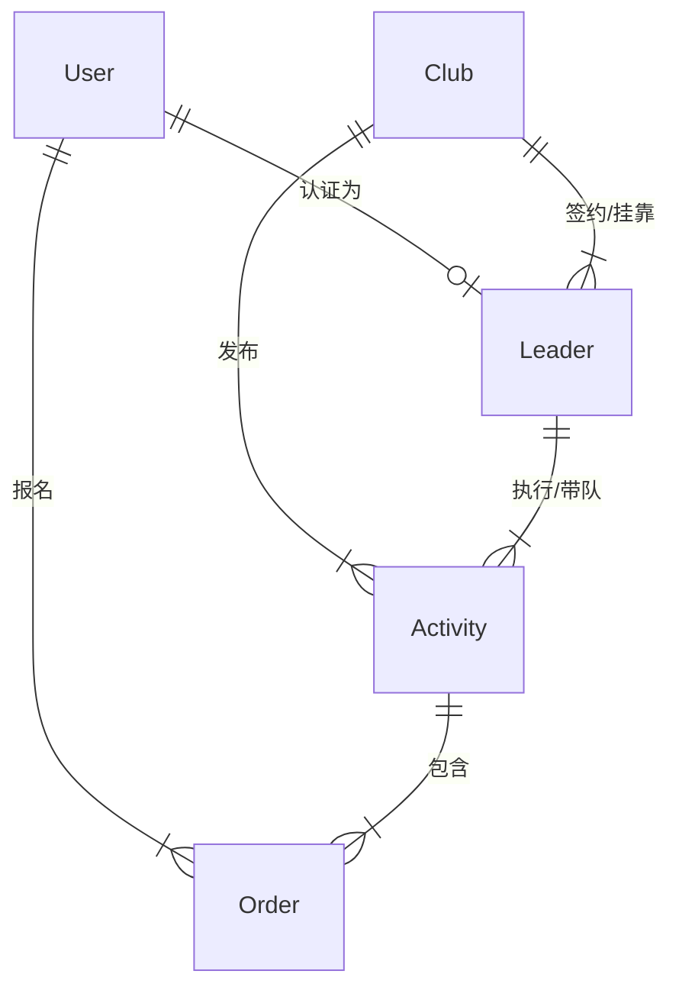

### 3.3 业务逻辑补充：俱乐部与领队管理体系

为了解决“逻辑自洽”问题，我们需要明确 **平台 (Platform)**、**俱乐部 (Club)**、**领队 (Leader)** 与 **用户 (User)** 四者之间的权责关系。

#### 核心实体关系图 (ER 概念)

#### 1. 俱乐部管理 (Club Management)
俱乐部是活动的**责任主体**和**资金结算方**。
*   **入驻流程**：提交营业执照/社团证明 -> 平台审核 -> 开通账户。
*   **权限**：
    *   **活动发布权**：只有认证俱乐部才能发布收费活动。
    *   **领队管理权**：邀请领队加入，审核领队挂靠申请，解绑违规领队。
    *   **财务权**：绑定对公/法人账户，查看活动营收，申请提现。

#### 2. 领队管理 (Leader Management)
领队是活动的**执行者**和**服务提供者**。
*   **身份属性**：领队首先是一个 `User`，通过实名认证 + 资质认证（登山协证书/红十字急救证）升级为 `Leader`。
*   **挂靠机制**：
    *   领队不能独立发布商业活动（法律风险），必须**挂靠**在至少一个俱乐部下。
    *   一个领队可以挂靠多个俱乐部（自由职业领队）。
*   **工作流**：
    *   **被指派**：俱乐部创建活动 -> 选择领队 -> 领队确认接单。
    *   **自主申报**：领队策划线路 -> 提交给俱乐部审核 -> 俱乐部批准并上架。

#### 3. 资金流转逻辑
1.  **用户支付**：钱进入平台监管账户。
2.  **活动成行**：资金冻结。
3.  **活动结束**：用户确认或 24小时自动确认。
4.  **分账结算**：
    *   平台扣除服务费 (e.g., 5%)。
    *   剩余资金进入**俱乐部余额**。
    *   俱乐部再根据线下协议给领队发劳务费（或系统后续支持自动分账）。
